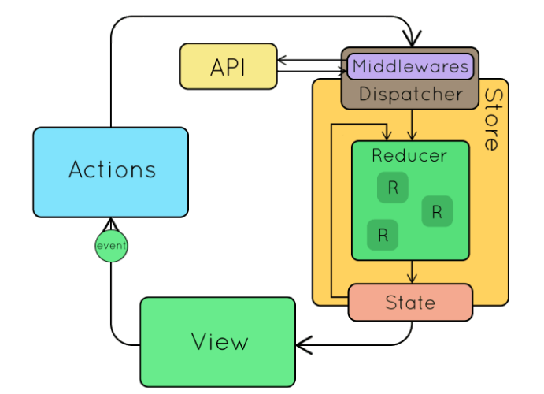

import EditedBy from '../../src/components/EditedBy'

### Configure ESLINT properly

ESLint covers both code quality and coding style issues. ESLint supports current standards of ECMAScript. Code using JSX or TypeScript can also be processed when a plugin or a transpiler is used. We can enable formatting on save in Visual Studio Code. This will auto correct the coding style when the file is saved. Add the below to settings.json to enable the same.

```json
"editor.formatOnSave": true,
"eslint.format.enable": true,
"eslint.lintTask.enable": true
```

### Destructure props

Try and use destructuring operators to reduce code complexity. For example,

```javascript
const country = this.props.country;
const color = this.props.color;
const flag = this.props.flag;
```

can be changed to

```javascript
const {country, color, flag} = this.props;
```

### Keep components small and function-specific

With React, it’s possible to have huge components that execute a number of tasks. A better way to design components is to keep them small, so that one component corresponds to one function. Ideally, a single component should render a specific bit of your page or modify a particular behavior. There are many advantages to this like:

- Function-specific components can be standalone, which makes testing and maintenance easier.
- Each small component can be reused across multiple projects.

### Name the component after the function

It’s a good idea to name a component after the function that it executes so that it’s easily recognizable.

For example, ProductTable – it conveys instantly what the component does. On the other hand, if you name the component based on the need for the code, it can confuse you(and your fellow developers) at a future point of time.

### Always use prop-types to define all the props in every components

If you're writing react with JavaScript, its always a good idea to check for PropTypes(like TypScript forces you to do). Prop-types helps to check the types of props passed to each components runtime.

Prior to React 15.5.0, a utility named PropTypes was available as part of the React package, which provided a lot of validators for configuring type definitions for component props. It could be accessed with React.PropTypes.

However, in later versions of React, this utility has been moved to a separate package named prop-types, so you need to add it as a dependency for your project in order to get access to the PropTypes utility. You can use it like

```jsx
Component.propTypes = {
  anyProp: PropTypes.any,
  booleanProp: PropTypes.bool,
  numberProp: PropTypes.number,
  stringProp: PropTypes.string,
  functionProp: PropTypes.func,
};
```

### Use displayName JSX property to define a particular name for a component

The display name for each components come in handy, when debugging the project. It differentiates each components in React dev tool which is available for both Google Chrome and Mozilla Firefox. Usually, you don’t need to set it explicitly because it’s inferred from the name of the function or class that defines the component. However, in cases where you want to set it explicitily, make sure to use this prop.

### Default values for props

Always use default values for props, which expects an undefined data.

#### Now, on to some general rules:

### Consolidate duplicate code – DRY your code

A common rule for all code is to keep it as brief and concise as possible. DRY snippets indicates a pattern in the code, which can be removable. Make a generic function to handle the requirement and invoke the same with different props.

### Create multiple files instead of writing a big file

Break down larger files into smaller pieces, keeping files smaller with fewer lines of code makes debugging and code maintanence much easier.

### Your first draft is not always the best one

Take your time to undeserstand the better approach for implementing a feature or fixing a bug. If you find a better way than what you have implemented already, please go for that. Also use TODO's to not lose track of changes you want to implement.

### Meaningful names for files

If you name your files according to the job that they perform, it will also help you in the future as well as other developers to understand what the file actually does.A better way will be to prefix them with the job that they are supposed to perform. For instance, userDropdown.js, fileDropdown.js, and so on.

### State management using Redux

Redux is a predictable state container for JavaScript apps. You can use Redux together with React, or with any other view library. It is tiny (2kB, including dependencies), but has a large ecosystem of addons available.

#### Installation

Redux is available as a package on NPM for use with a module bundler or in a Node application:

```bash
# NPM
npm install redux

# Yarn
yarn add redux
```

In this guide, we'll walk through.

- Store
- Actions
- Reducers
- Data flow
- Usage with React

#### Store

The store has the following responsibilities:

- Holds application state;
- Allows access to state via getState();
- Allows state to be updated via dispatch(action);
- Registers listeners via subscribe(listener);
- Handles unregistering of listeners via the function returned by subscribe(listener).

It's important to note that you'll only have a `single store` in a Redux application. When you want to split your data handling logic, you'll use reducer composition instead of many stores.

#### Actions

Actions are payloads of information that send data from your application to your store. They are the only source of information for the store. You send them to the store using `store.dispatch()`.

Here's an example action which represents adding a new todo item:

```javascript
const ADD_TODO = 'ADD_TODO';
```

Actions are plain JavaScript objects. Actions must have a `type` property that indicates the type of action being performed. Types should typically be defined as string constants.

#### Action Creators

Action creators are exactly functions that create actions. In Redux, action creators simply return an action:

#### Reducers

Reducers specify how the application's state changes in response to actions sent to the store. Remember that actions only describe what happened, but don't describe how the application's state changes.

#### Data flow



### Lazy loading

Most of the times our users don’t see the whole web page, at least in the beginning. No matter how our application UI has been structured, there are certain components the user might not need initially or ever!

In these cases, rendering those components not only harms our application’s performance but also wastes a lot of resources.

So, loading or rendering those components on demand seems to be a more efficient decision. It can improve the application’s performance, and at the same time can save us a lot of resources.

It can be done by using `React.lazy` or other libraries like `react-lazyload`

### Styled components

CSS-in-JS is a styling approach that abstracts the CSS model to the component level, rather than the document level. This is the idea that CSS can be scoped to a specific component only and as opposed to the document level. The benefits of using CSS-in-JS includes:

- **Reduce the number of HTTP requests:** CSS-in-JS would mean that we don't have to make HTTP requests to load assets and resources.
- **Styling Fragmentation:** Using CSS-in-JS means you can write styles freely without worrying about compatibility issues.

An example of the CSS-in-JS approach is styled-components. Styled Components allow you to write plain CSS in your components without worrying about class name collisions. It helps to write CSS that's scoped to a single component and does not leak to any other element in the page.

#### Installation

```bash
yarn add styled-components
```

### Environment Variables

Environment variables are variables that are available through a global process.env Object.

Your project can consume variables declared in your environment as if they were declared locally in your JS files. By default you will have NODE*ENV defined for you, and any other environment variables starting with REACT_APP*.

```bash
WARNING: Do not store any secrets (such as private API keys) in your React app!

Environment variables are embedded into the build, meaning anyone can view them by inspecting your app's files.

```

#### Method 1: Using npm scripts to set environment variables

```json
{
  "scripts": {
    "dev": "webpack --env.API_URL=http://localhost:8000 --config webpack.config.dev.js",
    "build": "webpack --env.API_URL=https://www.test.com --config webpack.config.build.js"
  }
}
```

#### Method 2: Using an .env file to set environment variables

The whole idea here is to create a file (called just .env) filled with your environment variables.

```yaml
API_URL=http://localhost:8000
```

<EditedBy name="Govind, Bibhu" date="17/05/2020" />
